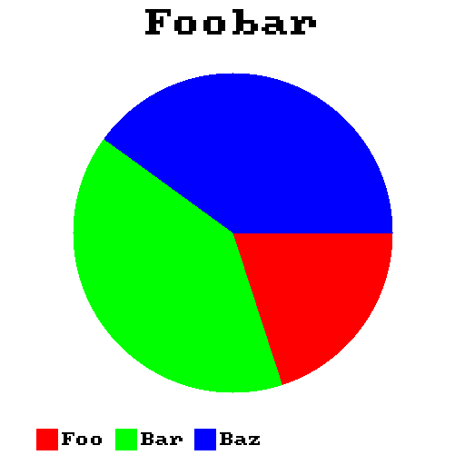

# cgraph

A single header C99 library to create graphs and plots with no dependencies.

⚠️Currently in extremely early alpha

## Functional Goals
- Allow users to create a variety of graphs
- Export said graphs to a variety of image formats
- Not rely on any third-party dependencies (ie handle all the rendering internally)
- Allow users to customize the look/style of their graphs

## Current Functionality
- [x] Bar Graphs
- [ ] Horizontal Bar Graphs
- [x] Pie Charts

## Usage
Simply define `CGRAPH_IMPLEMENTATION` and then include the header file:

```c
#define CGRAPH_IMPLEMENTATION
#include "cgraph.h"
```

As of right now (`12-29-2025`) cgraph only supports creating bar graphs, pie charts, and donut charts. Here is an example of how you would create a bar graph:

```c
#define CGRAPH_IMPLEMENTATION
#include "cgraph.h"

int main() {
  cg_bar_graph bg = cg_new_bar_graph("Foobar"); // create the bar graph
  
// add the individual bars, their labels, their values, and their colours
  cg_bar_graph_add_bar(&bg, "Foo", 40, (cg_colour){255, 0, 0});
  cg_bar_graph_add_bar(&bg, "Bar", 82, (cg_colour){0, 0, 255});
  cg_bar_graph_add_bar(&bg, "Baz", 67, (cg_colour){0, 255, 0});

  cg_image img = cg_bar_graph_render(&bg); // render the graph into an image 
  cg_bar_graph_free(bg);

  cg_image_export(img, "graph.ppm", PPM); // export the graph
  cg_image_free(img);
}
```

The output will then look something like this:


Here is how you would create a pie graph:

```c
#define CGRAPH_IMPLEMENTATION
#include "cgraph.h"

int main() {
  cg_pie_graph pg = cg_new_pie_graph("Foobar");
  cg_pie_graph_add_slice(&pg, "Foo", 20, (cg_colour){255, 0, 0});
  cg_pie_graph_add_slice(&pg, "Bar", 40, (cg_colour){0, 255, 0});
  cg_pie_graph_add_slice(&pg, "Baz", 40, (cg_colour){0, 0, 255});

  cg_image img = cg_pie_graph_render(&pg, false); // set this to true to render a donut chart, where only the edges of the pie chart are rendered
  cg_image_export(img, "circle.ppm", PPM);
  cg_image_free(img);
  cg_pie_graph_free(pg);

}

```

The output will look something like this:




## License

cgraph is licensed under the MIT license
