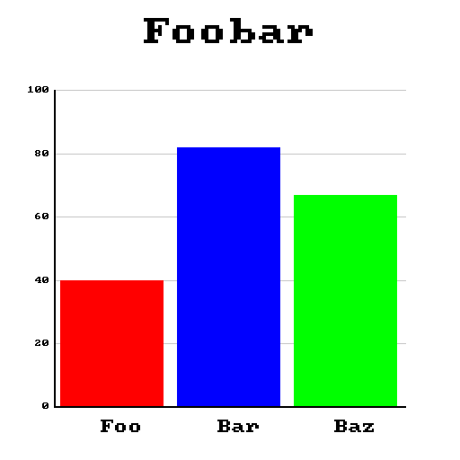

# cgraph

A single header C99 library to create graphs and plots.

⚠️Currently in extremely early alpha

## Functional Goals
- Allow users to create a variety of graphs
- Export said graphs to a variety of image formats
- Not rely on any third-party dependencies (ie handle all the rendering internally)
- Allow users to customize the look/style of their graphs

## Usage
Simply define `CGRAPH_IMPLEMENTATION` and then include the header file:

```c
#define CGRAPH_IMPLEMENTATION
#include "cgraph.h"
```

As of right now (`12-28-2025`) cgraph only supports creating bar graphs. Here is an example of how you would create one:

```c
#define CGRAPH_IMPLEMENTATION
#include "cgraph.h"

int main() {
  cg_bargraph *bg = cg_new_bargraph("Foobar"); // create the bar graph

  // add the individual bars, their labels, their values, and their colours
  cg_bargraph_add_bar(bg, "Foo", 40, (cg_colour){255, 0, 0});
  cg_bargraph_add_bar(bg, "Bar", 82, (cg_colour){0, 0, 255});
  cg_bargraph_add_bar(bg, "Baz", 67, (cg_colour){0, 255, 0});

  cg_image *img = cg_bargraph_render(bg); // render the graph into an image
  cg_bargraph_free(bg); // free the bar graph to prevent memory leaks

  cg_image_export(img, "graph.ppm", PPM); // export it to an image file. Currently cgraph only supports the PPM format
}
```

The output will then look something like this:



## License

cgraph is licensed under the MIT license
